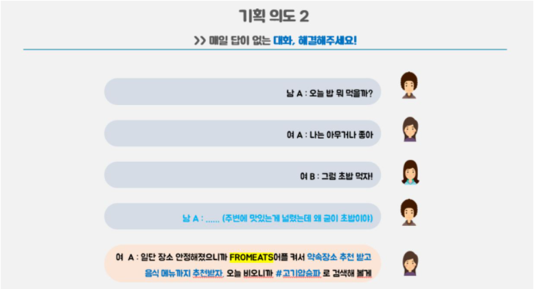
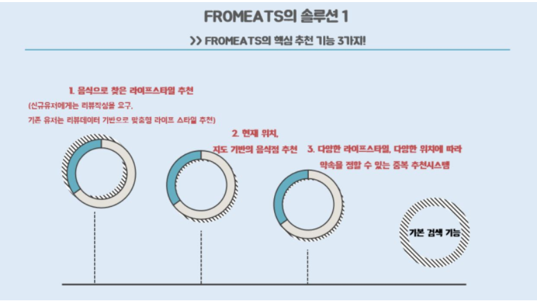
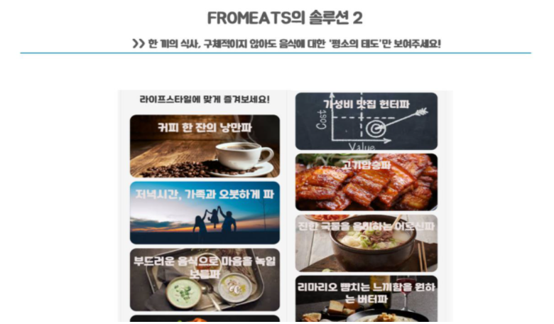
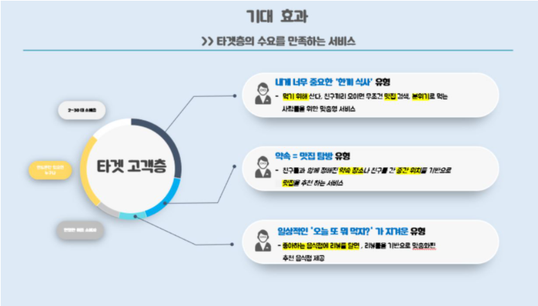
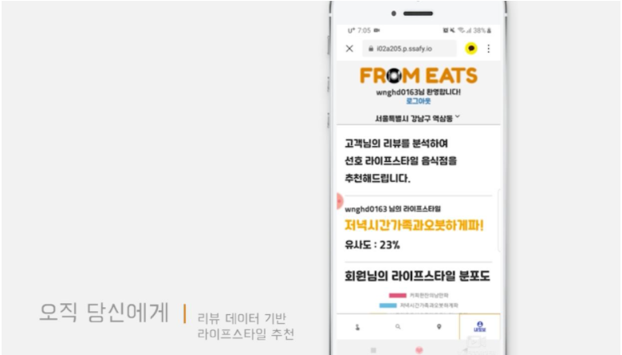
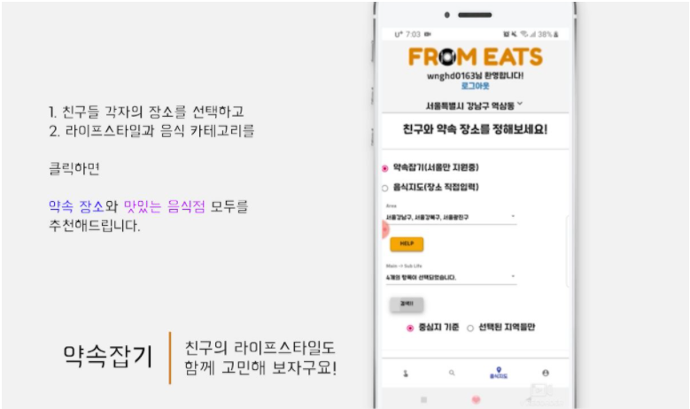
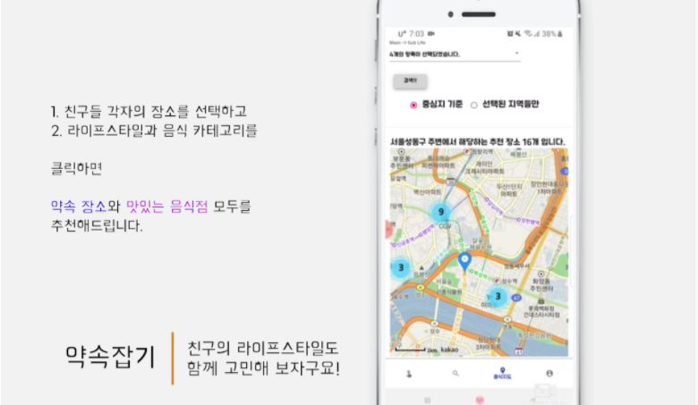

# FromEats

##   서비스 소개



















## How to Run

### Sub1

```sh
cd sub1
pip install -r requirements.txt
python parse.py
python analyze.py
python visualize.py
```

### Sub 2

**Backend**

```sh
cd sub2/backend
pip install -r requirements.txt
python manage.py makemigrations
python manage.py migrate
python manage.py initialize
python manage.py runserver
```

**Frontend**

```sh
cd sub2/frontend
npm install
npm run serve
```
